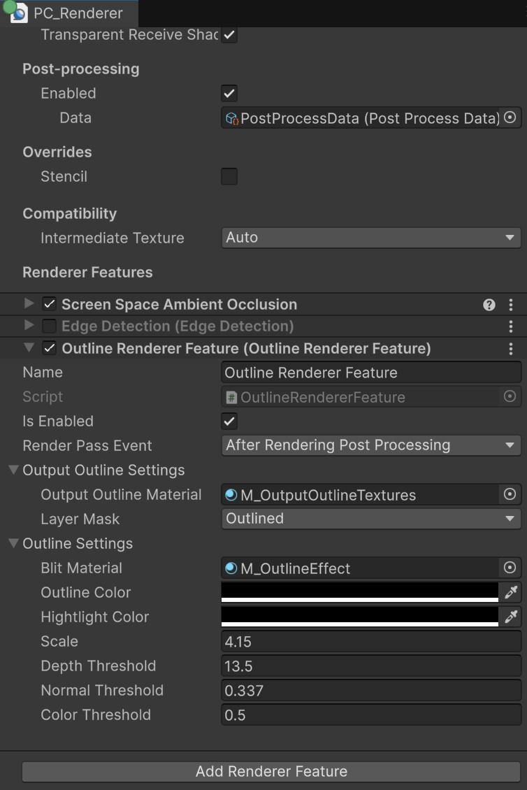

# Render craft - UniversalRP
Repository that will store a set of shaders and postprocesses to render toon, stylized, sketch, and other non-realistic effects.

###### Current support: Unity 6000.0.56f1 with UniversalRP 17.0.4

**Usage of the project**
* Clone the repository or download the zip to use this project locally.
* Load the project using Unity 6000.0.56f1 or later

**Project layout**
* `Scripts/Graphics/RendererFeatures`: This folder constains the Scriptable Render Features. Each Scriptable Render Feature is developed using two scripts, one concerning to the [ScriptableRendererFeature](https://docs.unity3d.com/Packages/com.unity.render-pipelines.universal@17.4/api/UnityEngine.Rendering.Universal.ScriptableRendererFeature.html), and the other one, that has the [ScriptableRenderPass](https://docs.unity3d.com/Packages/com.unity.render-pipelines.universal@10.6/api/UnityEngine.Rendering.Universal.ScriptableRenderPass.html) logic.
* `Shaders/Graphs` set of Shaders created using [Shader graph](https://unity.com/es/shader-graph), and `Shaders/Hand-written` will store a set of shaders using Unity's ShaderLab language.

# Examples
Below are shown the examples developed on this repository.

## Outline shader by filtering objects

This example shows how to filter a set of renderers based on the [layermask](https://docs.unity3d.com/ScriptReference/LayerMask.html), and then, generate a set of render textures that will store the Depth, Normals, and Color buffer. Those buffers will be subsequently used for generating the outline effect.

This example uses the [RenderGraph API](https://docs.unity3d.com/6000.0/Documentation/Manual/urp/render-graph.html) to write a Scriptable Render Passes in the Universal Render Pipeline (URP). Taking advantage of this API, it was used the following features:
- Filter objects by using the [DrawRendererListCommandBuffer.DrawRendererList](https://docs.unity3d.com/6000.0/Documentation/ScriptReference/Rendering.CommandBuffer.DrawRendererList.html) method.
- Multiple Render Targets (MRT) to store the Depth, Normals, and Color buffer.
- [Transfer a set of textures between render passes in URP](https://docs.unity3d.com/6000.0/Documentation/Manual/urp/render-graph-pass-textures-between-passes.html) to grab the aforementioned buffers to generate the outline effect.

By using this implementation, you can define a set of objects that you want to highlight by using the outline effect. In this case, all the objects that belong to the _*Outlined*_ layer mask will be filtered.

Then, the [OutputOutlineTexturesPass](Assets\Scripts\Graphics\RendererFeatures\Outline effect\OutputOutlineTexturesPass.cs) will generate the Normal, Depth, and Color buffers. These buffers are necessary to perform the operations that calculate the surface outlines.

In turn, the OutlineRenderPass will grab the aforementioned buffers to calculate the outline based on the [Roberts Cross Edge Detection](https://homepages.inf.ed.ac.uk/rbf/HIPR2/roberts.htm)

Finally, the outline is multiplied by a color and blitted onto the scene color buffer.

Files to take into account for achieving this:
* C# file(s):
    * Graphics:
        * RendererFeatures:
            * Outline effect:
                * [OutlineRendererFeature](Assets/Scripts/Graphics/RendererFeatures/Outline effect/OutlineRendererFeature.cs): ScriptableRendererFeature that allows to configure the outline render passes, and defines their execution order.

                * [OutputOutlineTexturesPass](Assets/Scripts/Graphics/RendererFeatures/Outline effect/OutputOutlineTexturesPass.cs):  Class that filters the object that will be affected by the outline effect, this is done via the `DrawRendererList` method.
                Also, it generates the Normal, Depth, and Color buffers using Multiple Render Targets (`SetRenderAttachment`) and registers them globally (`SetGlobalTextureAfterPass`) for later access.

                * [OutlineRenderPass](Assets/Scripts/Graphics/RendererFeatures/Outline effect/OutlineRenderPass.cs):  Class that retrieves the buffers, calculate the outline based on them, and Blit the result in the scene color.

    * Behaviors:
        * [ChangeToLayer](Assets/Scripts/ChangeToLayer.cs): This behavior changes the `LayerMask` to *Outlined* when an object is selected.
        If the object is already in the *Outlined* layer mask, it changes its value to the *Default* layer.
* Shader(s):
    * Hand-written:
        * Outline:
            * [OutputOutlineTextures](Assets/Shaders/Hand-written/Outline/OutputOutlineTextures.shader): Shader that calculates and stores the normal, depth, and color in a set of RenderTextures.
            * [OutlineEffect](Assets/Shaders/Hand-written/Outline/OutlineEffect.shader): This shader is responsible for reading the normal, depth, and color buffers to calculate the outline.
            For debugging purposes, there are a few shader variants  available to visualize the buffers and the outline result (`_VISUALIZEOPTION_OUTLINE`, `_VISUALIZEOPTION_NORMAL`, `_VISUALIZEOPTION_DEPTH`, `_VISUALIZEOPTION_COLOR`). You may remove them from your production build if they are not required.
            The `_VISUALIZEOPTION_OUTLINECOLOR` keyword defines the implementation where the outline is blended with the scene color. Make sure to use this shader variant or replicate the logic it contains.
# How to use
* _Step 1 — Define a new Layer Mask_

    Go to Edit > Project Settings > Tags and Layers, then create a new layer named _*Outlined*_.

    

* _Step 2 — Change layer mask in Runtime_
    Assign to a GameObject the _*ChangeToLayer*_ script and define the name of the layer that will be changed for.

    

* _Step 3 — Add and setup Renderer feature_

    In your Universal Renderer Data, you need to add the _*Outline Renderer Feature*_. Once it's added, you must configure its properties, specially the OutputOutlineMaterial (using the `OutputOutlineTextures` shader) and the Blit Material (using the `OutlineEffect` shader).
    
    

    :information_source: At this point, you will be able to observe the outline effect. So, you have to tweaked the settings depending on your needs.

* _Step 4 — Use the Volume framework_

    To offer a better user experience, a custom volume component named _*Outline Volume Component*_ was developed. You can add it to your post-processing volume and configure it to fit your project.

   

 :warning: Debugging options :warning:

You can observe the input (Normal, Depth, Color) and out buffers (Outline, OutlineColor) by selecting the Material that uses the `OutlineEffect` and changing the Visualize option.
That feature allows you to analyze how the buffers are defined.

 

# References
"If I have seen further it is by standing on the shoulders of giants" - Isaac Newton

## Edge detection
There are many articles on this subject, but the following are the ones I enjoyed the most.
The authors explain in detail how to achieved the edge detection effect in Unity, so before using this repository, I highly suggest to read the following articles.

* [Outline Shader](https://roystan.net/articles/outline-shader/) by Roystan
* [Edge Detection Outlines](https://ameye.dev/notes/edge-detection-outlines/) by Alexander Ameye
* [Outline Post Process in Unity Shader Graph (URP)](https://danielilett.com/2023-03-21-tut7-1-fullscreen-outlines/) by Daniel Ilett

# Resources
 * [Fat Marine, mGear Maya Rig (Guide and postScripts included)](https://milio-serrano.gumroad.com/l/hypza) by Emilio Serrano (https://milio-serrano.gumroad.com/).
 * [Utah Teapot PBR](https://sketchfab.com/3d-models/utah-teapot-pbr-185b612a223d4dd5b03e55376429574f) by hackmans.
 * [Stanford Bunny PBR](https://sketchfab.com/3d-models/stanford-bunny-pbr-42c9bdc4d27a418daa19b2d5ff690095) by hackmans.